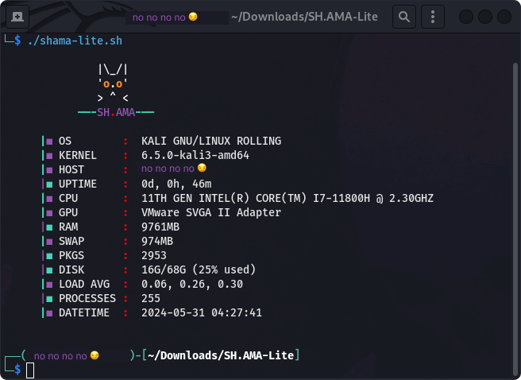

# SH.AMA-LITE

A lite version of a script that displays some basic information about my system.
 

I made this for my own personal use .

 Feel free to change it and adapt it to your needs .

Made with :

  

Tested on :

# Demo

Taken from a vm running kali

# Additional info

I will be releasing another more packed version at some point later on with more information displayed .

It's probably gonna be tailored for kali & ubuntu (as they are the distros i use on a daily basis)

# License

**SH.AMA-LITE**
released under the [MIT](LICENSE) License.
  

<strong>
Made with 🖤 by ZTF - N.EA | 2022 
 </strong>

